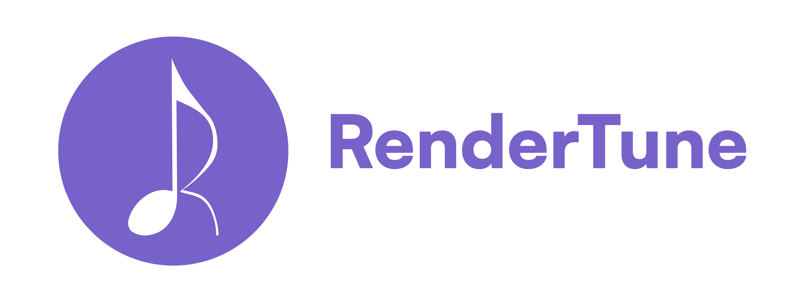
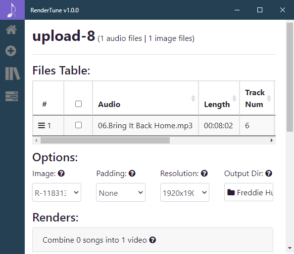
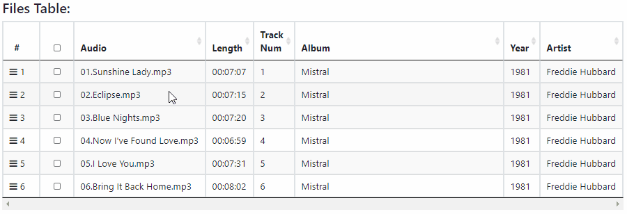
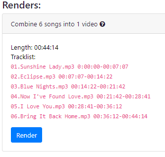
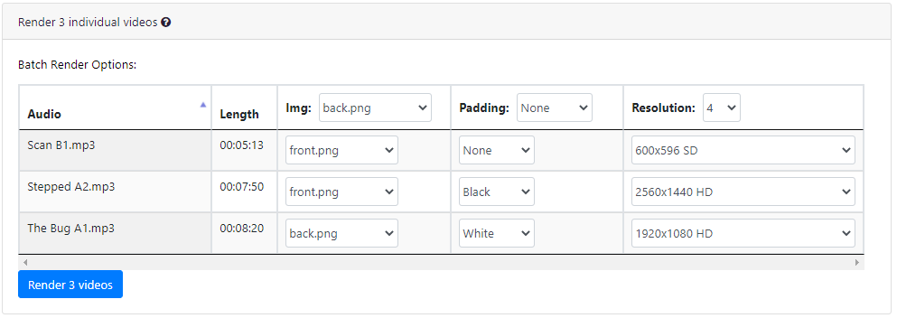
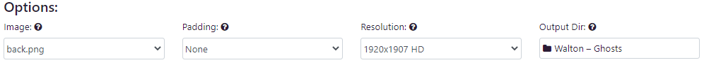
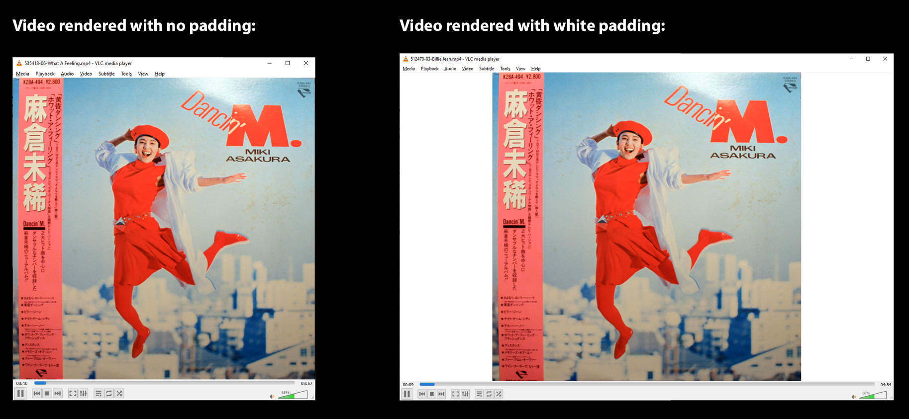
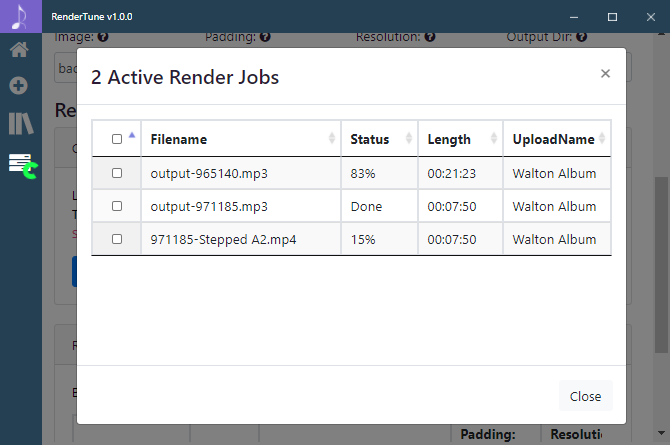

<p align="center"></p> 

<h1>RenderTune is a free open-source program for mac/win/linux to combine audio + image file(s) into video files that can be uploaded to YouTube.</h1>


# Note: 
I am currently working on a new version of RenderTune, if you want to clone the previous version of RenderTune, download release v1.1.4 (https://github.com/MartinBarker/RenderTune/releases/tag/v1.1.4) or checkout branch `main_backup_pre_react_rewrite`
Below is the previous README, the new README is located starting after line 20 ([RenderTune v2.0](#new-readme-rendertune-v20-react-rewrite))

## Tutorial Video (Click To Watch):
<a target="_blank" href="https://www.youtube.com/watch?v=LVnacPxquT4"></a>

## Download
RenderTune is available for free on the Mac Apple Store, Windows Store, and Linux Snap Store. Click any of the below badges to view the store page.

<a href="https://apps.apple.com/us/app/rendertune/id1552674375"></a> 
<a href="https://www.microsoft.com/store/apps/9n5710msppf1"></a> 
<a href="https://snapcraft.io/rendertune"></a>

If you want to download RenderTune without using the above stores, you can download RenderTune from the [most recent Github Release](https://github.com/martinbarker/rendertune/releases/latest/).

- [Mac OS X Installer (auto-updates): RenderTune-mac.dmg](https://github.com/martinbarker/rendertune/releases/latest/)
- [Windows Installer (auto-updates): RenderTune-Web-Setup-#.#.#.exe](https://github.com/martinbarker/rendertune/releases/latest)
- [Windows Portable: RenderTune-#.#.#.exe](https://github.com/martinbarker/rendertune/releases/latest)
- [Linux AppImage: RenderTune-#.#.#.AppImage](https://github.com/martinbarker/rendertune/releases/latest)
- [More releases](https://github.com/martinbarker/rendertune/releases/latest)


## Features:
- Use the Tracklist Table to reorder your songs by sorting the columns or dragging each song manually.
    
- Concatenate multiple audio files to play one after another in a single outputted video file.  
    
- Batch render multiple videos at once and customize options for each video.
    
- Video Render Options:
        
    - Image: Change which image to render your video with.
    - Padding: Add white or black padding to the outputted video frame.
        
    - Resolution: Change outputted video resolution.
    - Output Dir: Change outputted video location.

- Use the "Renders" popup to track the progress of your video renders.
    
- Supported audio formats: mp3, flac, wav, m4a, oog, wma, aiff. Supported image formats: png, jpeg, jpg, webp.
- Outputted video format: mp4. 

## How to run RenderTune locally:
- Clone this repo and cd into the folder.
- Run `npm i` and `npm i -g electron` if you haven't already installed electron globally.
- If you are on windows I recommend using command prompt, as that can launch electron apps fine, while Windows Linux Subsystem has troubles launching electron apps.
- If you are on a mac using the mac terminal, download brew and `ffmpeg-mac/` by following the instructions below.
- Download and setup `ffmpeg-mac/` folder (instructions below).
- Run `electron .` to start the program.

## How to install ffmpeg locally for mac (`ffmpeg-mac/`)
- If you are on mac; run `sh buildffmpeg.sh` to create the `ffmpeg-mac/` folder and statically build a version of ffmpeg that can be sandboxed and distributed to the mac apple store (mas).
- Verify your local `ffmpeg-mac/` folder has no dynamic libraries by running this command: 
`otool -L ffmpeg-mac/ffmpeg | grep /usr/local`
- If any files show up after running this command, delete or move those files, redownload the ffmpeg-mac/ folder, then run the 'otool' command again to verify there are no dynamic libraries in your local ffmpeg-mac/ folder. 

## Releasing a new version:
- Change version number in package.json (this is the bare minimum to change).
- Make sure you have local vars set for GH_TOKEN, APPLEID, and APPLEIDPASS.
- Mac: 
    - Download and setup `ffmpeg-mac/` folder.
    - Mac Apple Store: Change package.json mac build targets to only contain `"mas"`, verify the paths in `signmasscript.sh` are correct, then build & sign by running the command `npm run build-mas`. Upload the outputted RenderTune.pkg file to App Store Connect using Transporter, then create a new Mac Apple Store submission for review.
    - Mac .dmg Installer (auto-updates): Change package.json build targets to contain `"dmg", "zip"`, remove the RenderTune.pkg file we crated for MAS in the above step if it exists since we don't want to package that inside our build. Build & publish by running the command `npm run build-mac-publish`.
- Windows:
    - To sign a .appx build for the Windows Store you need to have a Windows SDK downloaded: https://www.electronjs.org/docs/tutorial/windows-store-guide.
    - Windows Installer (auto-updates), Windows Portable, and Windows Store .appx: On Windows, make sure env vars are set by running `echo %GH_TOKEN%` in command prompt terminal, build nsis-web/portable/appx targets with the command `npm run build-win-publish`. To sign the Windows Store Build, make sure you are on a computer with the powershell electron-windows-store requirements, and then run the following powershell command to generate a signed .appx file that you can upload to the Microsoft Store review system:
```
electron-windows-store --input-directory C:\Users\marti\Documents\projects\RenderTune\dist\win-unpacked --output-directory C:\Users\marti\Documents\projects\Appx --package-version 0.5.0.0 --package-name RenderTune --package-display-name 'RenderTune' --publisher-display-name 'martinbarker' --identity-name 1845martinbarker.digify -a C:\Users\marti\Documents\projects\RenderTune\Resources\
```
- Linux: 
    - Login to snap store from terminal: `$ snapcraft login`. Build & publish linux builds for snap and AppImage: `$ npm run build-linux-publish`. This will output a .snap file in the dist/ folder that you can upload using the command: `$ snapcraft upload --release=stable dist/rendertune_0.3.23_amd64.snap` (make sure your .snap filename is correct).
- Once all of the following steps have been followed, there should be a new RenderTune version drafted on GitHub with files uploaded for Mac, Windows, and Linux.

## Roadmap:
This list is of future updates / improvements I plan to make for RenderTune (If you can think of any features you would like, contact me and I will include them in the roadmap)
- UI Improvements: Better render status options, more efficent code.
- Add API to electron app so you can trigger renders using POST route.
- New Feature: Append/Prepend video file to video we are rendering (Add MP4 intro/outro, add MP3 intro/outro)
- New Feautre: Record, split, export and tag audio files.
- New Feature: Upload files to YouTube / tag


__________________________________________________________

# new-readme-rendertune-v20-react-rewrite

## How to setup and run locally:
`nvm install 20.9.0`

`nvm use 20.9.0`

`npm i -g yarn cross-env wait-on concurrently`

`yarn install`

`npm start`

## How to test build locally
`npm i -g electron-builder`
`electron-builder --windows`

### How to trigger a release build:
Tag a new version: `git tag v1.0.8`
Push the tag to GitHub: `git push origin v1.0.8`

# Common Errors:

## [win10 command prompt] `npm run build`:
- Error: `app-builder.exe process failed ERR_ELECTRON_BUILDER_CANNOT_EXECUTE Exit code: 1` / `downloaded url=https://github.com/electron-userland/electron-builder-binaries/releases/download/winCodeSign-2.6.0/winCodeSign-2.6.0.7z duration=1.695s ⨯ exit status 2`
- Fix: Run terminal / command prompt as admin.

```
# Windows Debugging
rmdir /s /q dist
rmdir /s /q node_modules
npm cache clean --force
yarn install
```

### How to setup Mac Apple Store signing:

- Need to set the following GitHub actions secret values:
```
APPLE_API_KEY_ID
APPLE_API_ISSUER
APPLE_API_KEY
MAC_CERTS
MAC_CERTS_PASSWORD
PROVISIONING_PROFILE_BASE64
SNAPCRAFT_TOKEN
```
- Usefull links for getting MAS/Mac credentials:
    - https://github.com/marketplace/actions/electron-builder-action
    - https://samuelmeuli.com/blog/2019-12-28-notarizing-your-electron-app/
    - https://mifi.no/blog/automated-electron-build-with-release-to-mac-app-store-microsoft-store-snapcraft/

## How to set the following requirered Mac Apple Store credentials in GitHub Actions -> Repository Secrets

- APPLE_API_KEY_ID
    - Navigate to Apple App Store Connect (https://appstoreconnect.apple.com/) -> Users and Access -> Click the 'integrations' tab at the top of the page, click on 'App Store Connect API' on the left, and under 'Team Keys' click the blue plus icon to generate a new key with App Manager access (https://appstoreconnect.apple.com/access/integrations/api).
    - I generated a key with the name 'RenderTune_2025_app_manager'
    - Copy the API Key ID, and save that as the secret value. 

- APPLE_API_KEY 
    - Download the key we just made, save it as a .p8 file
    - Open that file in vscode, copy the contents, and save that as the secret value.

- PROVISIONING_PROFILE_BASE64
    - Go to certificates: Certificates, Identifiers & Profiles - Apple Developer 
    - Create and download the following certs: 
        - Developer ID Installer (downloaded) 
        - Developer ID Application (downloaded) 
        - Mac Installer Distribution (downloaded) 
        - Mac App Distribution (downloaded) 
        - Mac Development (downloaded) 
    - Drag & drop them into "login" keychain access 

    - Go to provisioning profiles: 
        - Re-generate "App Store" and "Development" provisioning profiles 
        - macOS_app_development 
        - Com.martinbarker.digifyunique 
        - Check all certificates & devices 
        - Download: macOS_app_development_digifyunique.provisionprofile 

    - App store development 
        - Com.martinbarker.digifyunique 
        - Check the newly generated "Mac App Distribution" certificate's radio box 
        - Download: mac_app_store_connect.provisionprofile 

    - Run command to get contents 
        - base64 < mac_app_store_connect.provisionprofile | pbcopy 

    - Paste clipboard contents into PROVISIONING_PROFILE_BASE64 
- MAC_CERTS_PASSWORD
- MAC_CERTS
    - In keychain access, select the following, export save locally with strong password:
        - Developer ID Application: *
        - Developer ID Installer: *
        - 3rd Party Mac Developer Installer: *
        - 3rd Party Mac Developer Application: *

Add the following GH Actions secrets:
- MAC_CERTS_PASSWORD with the generated password
- MAC_CERTS to the output of this command: `base64 -i Certificates.p12 -o - | pbcopy`

- SNAPCRAFT_TOKEN
    - tbd